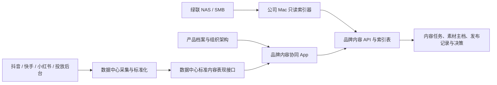

# 品牌内容协同功能设计书

## 用户任务

负责人进入 App 后首先处理当天的内容经营断点，而不是浏览装饰性指标：未发布、缺素材 ID、学习期到期、成熟但未获测试、数据未对平和待确认补充决策。

编导、剪辑和运营进入 App 后看到与自身角色相关的任务队列，并能沿内容主档查看 Brief、脚本、NAS 版本、审核、发布、投放表现和复盘结论。

## 信息层级

### 主信息

1. 当前需要谁处理什么问题。
2. 每个产品的产品链接基准、新素材状态、上线时长和下一步动作。
3. 每条内容的生产责任、NAS 版本、发布记录和数据质量。
4. 已确认的补充决策及其执行进度。

### 辅助信息

- 平台、账户、时间、内容目的和负责人筛选。
- 数据中心截止时间、覆盖率、对平差额和指标版本。
- 付费投放与自然内容的趋势和结构。

### 低频信息

- 学习期和有效测试阈值。
- NAS 共享目录、索引器和 MCP 状态。
- 历史导入、字段映射和审计记录。

## 页面结构

### 导航

“品牌内容协同”作为经营执行平台中的独立 App 分组，位于数据中心之后、平台之前。分组包含：

1. 内容总览
2. 内容作战台
3. 素材资产
4. 投放复盘
5. 品牌账号
6. 补充决策
7. 团队效能
8. 数据问题
9. 设置

左侧导航是唯一页面入口。右侧主工作区不得再渲染“内容总览、内容作战台、素材资产”等顶部二级导航。详情页使用页面标题、面包屑和明确返回动作，不增加第二套常驻导航。

### 内容总览

- 页头：页面标题、业务说明、数据中心状态和数据截止时间。
- 筛选栏：产品、平台、账户、负责人和时间范围。
- 今日焦点：未发布、学习期到期、未获有效测试、待补充决策和数据问题。
- 产品内容作战表：产品链接基准、新素材数量、上线结构、测试覆盖、当前判断和下一步。
- 责任队列：按当前用户角色展示需要处理的事项。
- 趋势区：付费内容新增 GMV/消耗贡献与品牌自然内容增长分开呈现。

### 内容作战台

默认使用高密度分组列表，不使用同尺寸卡片瀑布流。按生产状态显示内容行，可切换按产品、负责人或截止时间分组。每行包含：内容 ID、产品、目的、方向、主责任人、当前版本、截止时间、发布/数据状态和下一动作。

拖拽不是首版必需交互。状态流转通过明确按钮和服务端校验完成，避免误拖导致责任状态变化。

### 素材资产

使用列表与预览分栏：

- 左侧列表展示文件名、产品、内容 ID、版本、时长、修改时间、NAS 状态和发布数量。
- 右侧详情展示缩略图、相对路径、复制路径、打开目录、版本历史、脚本、审核和发布关系。
- 首版不在浏览器内播放超大原视频；可展示代理缩略图与基础媒体信息。

### 投放复盘

页面先展示数据质量和口径，再展示结果：

1. 数据中心截止时间、对平状态、覆盖率和差额。
2. 公司/账户/投放体系/目标小计。
3. 产品链接基准与素材归因对比。
4. 同龄素材、同账户和同产品对比。
5. “学习中、未获测试、方向有效、方向偏弱、产品承接弱、分配异常”分类。

当数据未对平时，判断区显示解释性禁用状态，不允许用户点击“确认内容问题”。

### 品牌账号

自然内容使用独立指标区：播放、完播、互动、收藏、分享、涨粉和内容复用。付费消耗、GMV 和 ROI 不进入自然内容账号排名；同一内容存在付费放大时用标记说明，不把付费播放当自然增长。

### 补充决策

列表按产品显示证据、建议动作和待确认字段。负责人确认时填写：数量、内容方向、目标账户、主编导、主剪辑、运营、截止时间和复盘日期。确认后生成新的内容主档，并记录来源内容和决策证据版本。

### 团队效能

按角色分栏展示，不做一个混合总榜：

- 编导：交付、按时、上线、有效测试、进入第二梯队和成熟样本表现。
- 剪辑：交付、返修、上线、有效测试、进入第二梯队和成熟样本表现。
- 运营：发布及时、素材 ID 完整、测试覆盖、分配执行和数据问题关闭时长。

默认不显示综合分。样本不足、仍在学习期或测试不足时明确标注，不用灰色小字隐藏限制。

### 数据问题

按严重度和责任角色显示：重复素材 ID、缺 ID、未映射产品、数据中心未对平、来源缺日、NAS 文件失联和平台字段缺失。问题行必须提供影响范围、责任人、恢复动作和最近重试时间。

### 设置

设置使用无嵌套卡片的矩阵结构，维护平台学习期、有效测试阈值、内容编号规则、NAS 共享目录、索引器状态、数据中心契约状态和历史导入。凭据不出现在 Web 表单。

## 架构与数据流

### 边界

- React 页面只组合 UI、调用品牌内容状态客户端和数据中心客户端，不直接访问 NAS 或外部平台。
- 内容业务规则放在 `src/domain`，不包含 provider 原始字段。
- 品牌内容写入通过 `functions/api` 的认证路由完成，使用独立 D1 表。
- 数据中心作为跨 App 事实提供方；品牌 App 只读取版本化标准契约，不复制其采集逻辑。
- NAS 索引器是品牌功能的本地配套服务，首版局部保留。出现第二个真实消费者前不抽成通用文件平台。

## 交互流程

### 创建与交付

1. 负责人从产品内容作战表或补充决策创建 Brief。
2. 选择产品、目的、方向、责任人和截止时间后生成内容 ID。
3. 编导提交脚本并进入剪辑；剪辑选择已索引 NAS 文件或登记待索引路径。
4. 负责人审核通过后进入待发布；退回必须填写具体反馈。
5. 运营发布并登记平台、账户、产品链接、发布时间和素材 ID。

### 数据回流与复盘

1. 页面读取数据中心最近成功快照并显示截止时间。
2. 系统先执行素材 ID、产品、账户、时间和对平检查。
3. 学习中内容只显示剩余时间；成熟但测试不足内容进入运营队列。
4. 成熟且测试充分内容与产品链接基准和同龄素材比较。
5. 负责人选择继续观察、追加测试、制作变体、新做方向、暂停复刻或修复数据。

### NAS

1. 本地索引器扫描管理员批准的 SMB 挂载目录。
2. 新增或修改文件生成元数据和缩略图引用，不上传原视频。
3. 内容页通过相对路径关联版本；打开目录由本地辅助能力处理。
4. NAS 离线、权限不足或文件移动时进入明确状态，业务记录不丢失。

## 组件复用

- `PageHeader`：页面标题、说明和右侧数据状态。
- `HeaderFilter`、`ProductPicker`：产品和常用筛选。
- `DataTable`：产品作战表、素材列表、团队效能和数据问题。
- `Button`、`Modal`、`ConfirmDialog`：状态动作、表单和高影响确认。
- `OrgSelect`：主编导、主剪辑、运营和协作者选择。
- `DatePickerField`：截止时间、发布时间、复盘时间和自定义区间。
- `DeliverablePreviewModal` 的预览边界仅用于轻量图片/文档；不复用为大视频播放器。

## 新增组件

新增组件先保留在 `src/features/brand-content/`，只有出现第二个真实业务消费者后再评估共享。

### ContentStatusBadge

同时显示生产状态或数据状态的文字、图标和语义色。支持 `loading`、`unknown` 和 `blocked`，不能只靠颜色表达。

### DataQualityGate

输入对平状态、覆盖率、差额和截止时间；输出警告、影响范围和动作禁用原因。该组件不计算业务指标。

### ContentOperationsTable

组合产品链接基准、新素材、上线时长、测试状态和下一步动作。保持稳定列宽和横向滚动，不在单元格内嵌套卡片。

### NasAssetPicker

在已索引目录内搜索文件并选择版本。支持键盘搜索、只读路径、离线状态和未匹配状态；不接收 NAS 密码。

### DecisionEvidencePanel

展示生成补充决策所依据的数据版本、比较范围和限制，并要求负责人确认数量与责任人。

## 页面状态

- 加载：页面骨架保留表格列结构；生产数据和表现数据分别加载，避免全部空白。
- 空数据：区分“尚未创建内容”“当前筛选无结果”“数据中心尚未供数”“NAS 尚未索引”，每种状态提供对应下一步。
- 错误：说明失败来源、受影响页面、上次成功时间和重试动作。
- 无权限：显示当前身份、允许查看范围和权限申请方向；服务器独立拒绝写入。
- 禁用：按钮旁或提示区域说明具体原因，例如“素材仍在学习期”或“数据尚未对平”。
- 成功：保存后显示新状态、责任人和下一步，不只显示“保存成功”。

## 错误处理

- 品牌 API 使用稳定错误码区分认证、权限、版本冲突、重复素材 ID、无效状态流转和依赖不可用。
- 写入带版本号，检测并发修改后返回冲突，不静默覆盖他人更新。
- 数据中心读取超时不阻塞生产协同；页面使用上次快照并显著标记过期。
- NAS 索引重试按文件批次执行；单个文件解析失败不阻塞其他文件。
- 所有自动建议记录指标版本和生成时间，数据更新后标记“需重新判断”。

## 响应式与钉钉 WebView

- ≥1120px：固定左侧导航，主区使用表格与可选详情分栏。
- 760–1119px：左侧导航折叠，表格横向滚动，责任队列移到主表下方。
- <760px：按焦点、筛选、列表、动作顺序单列；详情使用全屏抽屉。
- 不渲染顶部二级导航；窄屏通过左侧导航抽屉切换页面。
- 使用 `100dvh`、安全区内边距和明确滚动容器，避免钉钉 WebView 双滚动。

## 交互文案

- 数据正常：“数据中心已同步至昨日”。
- 数据过期：“表现数据停留在 7 月 16 日，生产协同仍可使用”。
- 学习期：“学习中 · 还需 2 个完整日”。
- 测试不足：“已成熟但未获有效测试，请先检查账户与投放分配”。
- 未对平：“公司总盘仍有差额，暂不能确认内容问题”。
- NAS 离线：“NAS 索引暂不可用，当前显示上次扫描结果”。
- 样本不足：“成熟样本不足，暂不排名”。
- 补充确认：“确认后将创建 2 条内容任务，并在复盘日重新判断”。

## 无障碍

- 左侧导航、筛选、表格操作、详情和弹窗按视觉顺序进入焦点。
- 状态使用文字和图标，颜色仅作辅助；正文与背景达到 WCAG AA。
- 表格列头使用正确语义，行操作有包含内容名称的无障碍名称。
- 键盘用户可完成筛选、打开详情、选择 NAS 文件、提交审核和确认决策。
- 动效只用于状态变化和详情过渡，并提供 `prefers-reduced-motion` 降级。

## 测试设计

- 领域测试：状态流转、学习期、有效测试、重复 ID、数据质量门禁和人员统计。
- 契约测试：品牌内容 API 的认证、权限、并发、错误码；数据中心接口字段、版本和降级。
- 组件测试：唯一左侧导航、加载/空/错/禁用、键盘焦点和语义状态。
- 索引测试：允许目录、相对路径、文件移动、NAS 离线、只读权限和增量扫描。
- 浏览器验收：内容总览、作战台、素材详情、投放未对平、补充决策、移动窄屏和钉钉 WebView。

## 视觉验收

1. 1440×900 内容总览：左侧品牌分组与高密度产品作战表。
2. 1280×800 素材资产：列表与详情分栏、长文件名和 NAS 离线状态。
3. 1120×720 投放复盘：数据质量警告、横向表格和禁用判断动作。
4. 760×900 内容作战台：折叠导航、单列责任队列和可达操作。
5. 390×844 数据问题：移动筛选、列表详情和安全区。
6. 键盘全流程：进入页面、筛选、打开内容、审核、返回和确认决策。

验收重点为层级、间距、对齐、内容密度、状态一致性、响应式与控件行为。不得出现顶部重复导航、嵌套卡片、渐变文字、装饰性大指标或无原因禁用。
