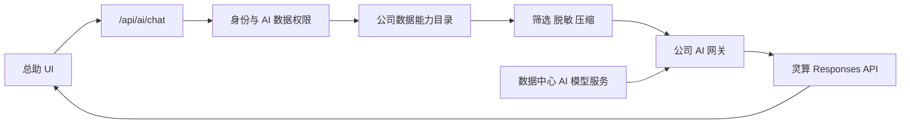

# 公司 AI 总助功能设计书

## 用户任务

员工在不离开当前业务工作的情况下向公司总助提问，获得基于其权限范围的跨 App 事实汇总、风险判断和下一步建议；管理层可以展开总助工作台进行较长的经营分析。总经办在数据中心查看模型服务状态并维护安全配置。

## 信息层级

- 主信息：对话、当前可使用的数据域、回答正文、参考 App 与数据日期。
- 辅助信息：当前 App 提示、未纳入范围、Provider 状态、生成耗时和 request ID。
- 低频信息：模型、推理强度、连接测试、用量元数据、数据外发策略和最近复核人。

## 页面结构

### 全局入口

顶部栏在账号菜单左侧增加“AI 总助”按钮，包含图标和文字，不使用悬浮营销气泡。入口在所有已登录业务 App 中常驻；功能关闭时不渲染，Provider 未就绪时仍可打开并看到可恢复配置状态。

### 右侧面板

- 桌面宽度 460px，最小 400px，最大不超过视口 42%。
- 顶部：总助标题、Provider 安全状态、展开工作台、清空、关闭。
- 欢迎区：可用数据域、更新时间、四个公司级快捷问题。
- 对话区：用户消息、总助流式回答、数据域引用和限制说明。
- 输入区：多行输入、发送/停止按钮、剩余字数和“只读分析”说明。

### 总助工作台

隐藏路由 `#ai-assistant`，不增加左侧业务 App 分组。工作台使用主内容宽度，左侧为当前浏览器会话中的对话列表，右侧为当前对话；首期不显示跨设备历史或长期记忆。

### 数据中心 AI 模型服务

在“数据服务”页面的应用订阅之前增加“AI 模型服务”区块：

- 状态摘要：启用、密钥已配置、最近测试、当前模型、`store=false`。
- 配置矩阵：Provider、协议、白名单 Base URL、模型、推理强度、启停。
- 数据外发矩阵：普通经营数据允许、财务数据阻止，并显示原因与复核时间。
- 操作：保存安全元数据、使用合成数据测试连接。
- API Key 不提供输入框；展示服务端 Secret 配置说明和布尔状态。

## 交互流程

1. 点击“AI 总助”后面板从右侧进入，焦点移到标题；原页面保持可见且不改变路由。
2. 首次打开读取 `/api/ai/status`，展示功能、Provider、密钥和可用数据域状态。
3. 点击快捷问题或输入问题后，前端只提交消息历史和当前路由提示。
4. 服务端返回首个 SSE 元事件，声明 request ID、允许域和被阻止域；UI 先展示数据范围再接收正文。
5. 文本增量逐步追加；来源事件更新回答下方的 App 标签和数据日期。
6. 用户点击停止时中止浏览器请求；服务端记录流被取消，不自动重试。
7. 失败时保留用户问题和已生成内容，显示“重新生成”；重新生成创建新 request ID。
8. 点击展开切换到工作台并保持当前会话；浏览器返回后仍可从面板继续。
9. 点击清空需要二次确认，只清除当前浏览器会话，不调用服务端删除。

## 组件复用

- `Button`：发送、停止、重试、连接测试和保存。
- `ConfirmDialog`：清空当前会话。
- `PageHeader`：总助工作台标题。
- `DataTable`：数据中心外发策略和安全状态列表。
- `react-markdown` 与 `remark-gfm`：渲染总助文本，沿用说明书已有安全 Markdown 边界。
- 现有状态徽章、错误提示、CSS 变量和焦点规范。

## 新增组件

- `AiAssistantProvider`：管理面板、当前会话、SSE 请求、中止和 sessionStorage；不保存公司业务数据。
- `AiAssistantTrigger`：顶部栏入口，只消费 Provider 状态和打开动作。
- `AiAssistantPanel`：桌面侧栏/窄屏全屏容器，负责焦点、Esc 和关闭后焦点恢复。
- `AiConversation`：消息、流状态、来源、限制和错误恢复。
- `AiComposer`：输入限制、发送、停止和键盘行为。
- `AiAssistantWorkspace`：复用同一会话组件的完整工作台组合。
- `AiProviderSettings`：数据中心内的 Provider 状态、配置、外发策略和连接测试。

这些组件属于 `src/features/ai-assistant` 或 `src/features/data-center`。不把公司总助抽到 `src/ui`；基础按钮、表格和对话框继续复用已有业务中立组件。

## 页面状态

- 加载：保留面板结构，状态与欢迎区使用轻量骨架。
- 未启用：解释“公司 AI 总助尚未启用”，不展示可发送输入框。
- 密钥缺失：总经办看到数据中心配置指引；其他员工只看到“模型服务未就绪”。
- 空会话：展示数据范围和公司级快捷问题，不伪造洞察。
- 无可用数据：允许一般方法回答前必须明确“没有纳入公司事实”；首期默认停止公司分析，避免泛化回答冒充内部结论。
- 财务阻止：在回答前和来源区持续显示“未纳入财务数据”。
- 生成中：发送按钮切换为停止，输入保持可编辑但不能启动第二个请求。
- 流中断：保留已生成内容，标记不完整并提供重试。
- 429/超时/Provider 失败：展示稳定中文错误、request ID 和恢复方式。
- 成功：回答下显示参考 App、数据日期和未纳入范围。
- 无权限：不显示被拒绝域的记录数、名称或数据是否存在。

## 响应式与钉钉 WebView

- `> 1100px`：460px 固定右侧面板，主内容不强制重排；面板使用独立滚动。
- `641–1100px`：面板宽度为 `min(460px, 55vw)`，背景遮罩降低误操作。
- `<= 640px`：使用 `100dvh` 全屏，适配安全区；输入区随软键盘保持可见。
- 工作台在 900px 以下隐藏会话侧栏，仅保留当前会话。
- 不使用大请求 `keepalive`；切页或关闭面板可中止流。
- 390px 不出现页面级横向溢出，代码块和表格仅在消息内部滚动。

## 交互文案

- 入口：`AI 总助`
- 标题：`公司 AI 总助`
- 副标题：`跨业务 App 的只读分析与建议`
- 快捷问题：`今天最需要关注什么？`、`跨 App 查找风险`、`哪些项目可能延期？`、`分析某个产品的经营表现`
- 财务阻止：`当前模型服务未通过财务数据外发审核，本次未纳入成本、利润、预算、结算和奖金数据。`
- 密钥缺失：`模型服务尚未配置新的服务端密钥。`
- 只读说明：`总助只提供分析和建议，不会修改数据或执行外部动作。`
- 流中断：`回答未完整生成，已保留现有内容。`

## 无障碍

- 入口使用可见文字和 `aria-expanded`、`aria-controls`。
- 面板使用对话区域语义但不阻塞主页面；窄屏全屏模式使用模态焦点约束。
- 打开后焦点移到标题，关闭后返回原触发按钮；Esc 关闭，生成中 Esc 先停止再关闭。
- 消息区使用 `aria-live="polite"`，但按句节流播报，避免每个 token 重复打断。
- 发送快捷键为 `Ctrl/Command + Enter`，Enter 保留换行。
- 数据域状态不只依赖颜色，所有徽章包含文字。
- 动画遵循 `prefers-reduced-motion`；流式文本不使用逐字视觉闪烁。

## 视觉验收

检查 1440、1280、900、640 和 390px：

- 面板空会话、生成中、成功、财务阻止、超时、流中断和密钥缺失。
- 工作台长回答、Markdown 表格、代码块、引用 App 超过一行。
- 数据中心 Provider 未配置、已配置未启用、连接成功、连接失败和只读身份。
- 键盘完整操作、焦点可见、关闭后焦点恢复、软键盘和钉钉 WebView 安全区。

## 架构与数据流

- 浏览器不上传业务数据。
- 公司数据能力目录只调用现有服务端存储边界，不复制业务表。
- Provider payload 与公司上下文模型在适配器边界转换；Provider 字段不能进入领域数据。
- Context 按域输出结构化摘要和来源元数据，不发送未经限额的完整记录集合。

## 错误与观测

- 新错误前缀 `AI_`，覆盖关闭、未配置、权限、外发阻止、限流、超时、Provider、流和上下文错误。
- 每个请求生成 request ID；SSE 首事件和错误事件都携带该 ID。
- 审计只记录身份、数据域、用量、耗时和结果码，不记录内容。
- Provider 原始错误正文、响应 Header 和堆栈不得返回浏览器或写入审计。
- 连接测试使用固定合成问题“返回 ok”，不调用公司数据能力目录。
