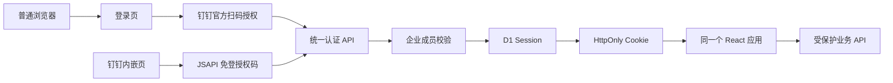

# 钉钉网页登录与统一会话设计

## 目标

在不迁移现有 D1 业务数据、不拆分业务前端的前提下，为产品全周期系统增加普通浏览器钉钉扫码登录，并继续兼容钉钉内嵌免登。两个入口使用同一个 React 应用、同一套权限、同一个 D1 数据源和同一组钉钉集成接口。

登录仅允许当前企业组织架构中的在职员工。未登录用户和非本企业账号不能读取需求、产品、任务、销售数据或钉钉组织信息。

## 范围

本次包含：

- 普通浏览器登录页和钉钉官方扫码授权入口。
- 钉钉内嵌环境继续使用 JSAPI 免登。
- 两种授权码在服务端完成身份换取并生成统一 Session。
- 服务端校验用户属于当前企业组织架构。
- D1 Session 与组织成员缓存表。
- 业务 API 的登录和权限保护。
- 退出登录、过期登录和异常状态。
- 本地开发专用测试登录继续存在，但绝不进入生产界面。

本次不包含：

- Mac mini 部署。
- D1 向 PostgreSQL 或 NoSQL 迁移。
- 业务页面、流程规则或产品数据结构重构。
- 引入 Keycloak 等独立身份平台。

## 方案选择

采用“钉钉 OAuth / JSAPI + D1 服务端 Session”。不继续把 `productFlowUser` 作为可信身份来源，也不使用纯前端角色判断保护 API。

### 未采用方案

- 仅在前端保存扫码结果：实现快，但 localStorage 可被修改，无法保护 API。
- 单独维护浏览器版和钉钉版：会造成页面、权限和业务逻辑分叉。
- 立即迁移数据库：与本次认证目标无关，扩大故障范围。

## 总体架构

React 只消费“当前会话”接口，不关心登录来自扫码还是钉钉内嵌。钉钉身份换取、企业成员校验、角色映射和 Session 创建全部在服务端完成。

## 登录流程

### 普通浏览器

1. React 启动后请求 `GET /api/auth/session`。
2. 未登录时只渲染登录页，不请求 `/api/state`、销售数据或组织架构。
3. 用户点击“钉钉扫码登录”。
4. 浏览器访问 `GET /api/auth/dingtalk/start`。
5. 服务端生成一次性 `state`，设置短期安全 Cookie，并跳转到钉钉官方授权页。扫码界面由钉钉提供，不在产品系统中自行生成二维码。
6. 钉钉授权后回到 `GET /api/auth/dingtalk/callback`。
7. 服务端校验 `state`，用授权码换取钉钉用户身份。
8. 服务端使用 `unionId` / `userId` 对照当前企业成员缓存；缓存缺失或超过 15 分钟时先刷新组织架构。
9. 非本企业成员、已离职或无有效组织身份的用户返回拒绝页，不创建 Session。
10. 验证成功后创建 7 天有效 Session，写入安全 Cookie，并重定向到 `/`。

### 钉钉内嵌

1. React 检测到钉钉运行环境且 `GET /api/auth/session` 未登录。
2. 使用现有 JSAPI `requestAuthCode` 获取免登授权码。
3. `POST /api/auth/dingtalk/embedded` 将授权码交给服务端。
4. 服务端通过企业应用身份换取用户并执行同一套企业成员校验。
5. 创建与浏览器登录完全相同的 Session Cookie。
6. React 重新读取 `/api/auth/session`，随后加载业务数据。

## 会话模型

D1 新增 `product_flow_sessions`：

| 字段 | 说明 |
| --- | --- |
| `id_hash` | 随机 Session Token 的 SHA-256，不保存明文 Token |
| `corp_id` | 企业 CorpId |
| `user_id` | 企业内 userId |
| `union_id` | 钉钉 unionId |
| `role` | 当前角色映射结果 |
| `login_mode` | `browser` 或 `embedded` |
| `created_at` | 创建时间 |
| `last_seen_at` | 最近使用时间 |
| `expires_at` | 过期时间 |
| `revoked_at` | 主动退出或管理员撤销时间 |

Cookie 名为 `pfs_session`，属性固定为：

- `HttpOnly`
- `Secure`
- `SameSite=Lax`
- `Path=/`
- `Max-Age=604800`

Session 每次使用检查过期和撤销状态。退出登录删除 D1 Session 并清除 Cookie。前端 localStorage 可以保留 UI 缓存，但不再保存或决定可信角色。

## 企业成员缓存

D1 新增 `product_flow_org_members`，保存登录校验所需的最小目录信息：`corp_id`、`user_id`、`union_id`、姓名、部门、职位、角色、在职状态和同步时间。

组织架构在以下时机刷新：

- 成功登录后发现缓存缺失或超过 15 分钟。
- 现有组织同步操作被调用时。
- 管理员在设置页主动刷新时。

会议、待办和人员选择器只读取缓存，不在每次操作时重新拉取完整组织架构。同步后未出现的旧成员标记为失效，不能再作为新待办或会议参与人。

## API 边界

公开接口仅包括：

- `GET /api/auth/session`
- `GET /api/auth/dingtalk/start`
- `GET /api/auth/dingtalk/callback`
- `POST /api/auth/dingtalk/embedded`
- `POST /api/auth/logout`
- `GET /api/dingtalk/config` 中不含密钥的公开配置

必须登录才能访问：

- `/api/state`
- `/api/sales`
- `/api/dingtalk/org/*`
- `/api/dingtalk/todo/*`
- `/api/dingtalk/calendar/*`
- `/api/dingtalk/meeting/*`
- `/api/dingtalk/doc/*`

读取业务数据要求有效企业员工 Session。写入操作还要按 Session 中的角色和现有权限矩阵校验，`readonly` 不能通过直接请求绕过前端限制。

统一服务端中间层提供：

- `readSession(request, env)`：读取并验证 Session。
- `requireSession(request, env)`：未登录返回 401。
- `requireWriteAccess(request, env, feature)`：没有功能编辑权限返回 403。
- `createSession(identity, mode, env)`：创建 Session 和 Cookie。
- `revokeSession(request, env)`：注销当前 Session。

## 前端结构

新增认证状态机：

- `checking`：只显示全屏加载，不加载业务数据。
- `anonymous-browser`：显示扫码登录页。
- `anonymous-embedded`：自动执行钉钉免登。
- `authenticated`：加载当前 React 应用。
- `forbidden`：显示非本企业员工提示和重新登录按钮。
- `error`：显示可重试的服务异常，不展示业务数据。

登录页保持当前产品工具的浅色、紧凑风格，内容只包括产品名称、钉钉登录按钮、企业员工限制说明和明确错误状态。页面不放功能介绍、营销文案或本地测试入口。

右上角账号区域增加菜单，仅提供账号信息和“退出登录”。钉钉内嵌与普通浏览器行为一致。

## 错误处理

- OAuth `state` 不匹配：终止登录，显示“登录请求已失效，请重新扫码”。
- 授权码过期或重复使用：终止登录，不重试旧授权码。
- 非本企业员工：返回 403，不写 Session。
- 组织架构刷新失败但存在 24 小时内缓存：使用缓存并记录告警。
- 组织架构刷新失败且无可用缓存：拒绝登录，避免错误放行。
- Session 过期：API 返回 401，前端清空 UI 身份并回到登录页。
- 权限不足：API 返回 403，前端显示具体操作无权限，不退出登录。

## 安全要求

- AppSecret 只存在 Cloudflare 服务端环境变量。
- OAuth 回调地址必须与钉钉开放平台配置完全一致。
- 授权 `state` 一次性使用，10 分钟过期。
- Session Token 至少 32 字节随机值，D1 只保存哈希。
- 登录和回调接口不返回用户 access token、AppSecret 或 Session 明文。
- 所有业务写接口拒绝跨站请求和无 Session 请求。
- 生产环境不渲染本地测试登录按钮。

## 测试与验收

自动测试覆盖：

- 普通浏览器未登录只显示登录页，且不请求业务 API。
- 钉钉内嵌未登录自动请求 JSAPI 授权码。
- 浏览器 OAuth `state` 校验成功和失败路径。
- 本企业成员登录成功并创建 Cookie。
- 非本企业、失效成员和无组织缓存时登录失败。
- Session 创建、读取、过期、退出和撤销。
- `/api/state`、销售和钉钉接口的 401 / 403 保护。
- `readonly` 无法直接调用写接口。
- 本地测试入口不会进入生产构建。

人工验收覆盖：

1. Chrome 无 Session 打开生产地址，看到登录页。
2. 使用公司钉钉扫码，进入系统并显示正确姓名、部门和职位。
3. 刷新页面仍保持登录。
4. 退出后业务数据不再可见。
5. 钉钉工作台打开同一地址，自动免登并进入同一份数据。
6. 非企业账号扫码被拒绝。
7. 登录后创建一条测试待办和日程，确认钉钉功能仍使用当前用户身份。

## 发布策略

认证改造先在本地使用模拟钉钉响应完成自动测试；随后发布到 Cloudflare Preview 验证真实扫码回调。Preview 验收通过后再合并到生产 `main`。发布前不修改现有 D1 公司业务状态，只新增认证和组织成员表。
