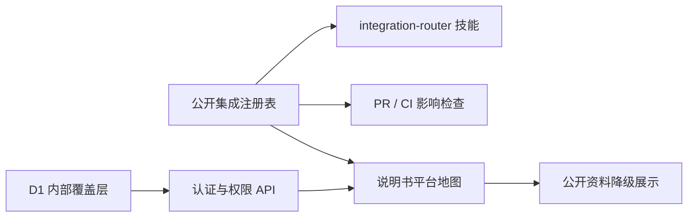

# 外部平台集成路由与平台地图设计

## 背景

项目已经接触钉钉、快麦、阿里云、Cloudflare 与多个电商和投放平台，但这些信息分散在代码、文档和历史任务中。后续开发遇到相似问题时，开发者无法稳定判断应该先查看哪个平台、哪些公开文档、哪些内部控制台以及哪些关联能力。

本设计把外部平台知识从被动文档升级为可执行的项目治理能力，并在应用说明书中提供所有员工可见的平台地图。

## 目标

- 用一份可机读公开注册表描述平台、状态、能力、关键词、代码边界和依赖关系。
- 让 Codex、分支开发、PR 模板和 CI 使用同一个事实源。
- 在说明书中展示可搜索、可筛选、可追溯的平台地图。
- 将内部控制台、账号主体、负责人和运行手册存入登录后才能读取的 D1 覆盖层。
- 不在仓库或内部资料层保存密钥、令牌、Cookie、密码和私钥。

## 非目标

- 本期不直接调用计划中平台的 API。
- 本期不替代各平台官方文档、控制台或密钥管理系统。
- 本期不自动部署、不更改远端分支保护规则，也不发送真实钉钉动作。

## 单一事实源

`docs/platform/integration-registry.json` 是公开集成事实的唯一来源。每个平台包含：

- 稳定 ID、中文名称、状态与状态证据。
- 业务能力、常见问题、提示词关键词。
- 相关代码路径、环境变量名和外部域名。
- 官方公开文档链接。
- 与其他平台或系统边界的关系。

状态只能是 `connected`、`integrating`、`planned`、`retired`。初始状态为：

- 已连接：钉钉、快麦、Cloudflare Pages、Cloudflare D1。
- 集成中：阿里云、ERP/文件导入。
- 计划中：淘宝、拼多多、小红书、巨量引擎/千川。
- 已停用：暂无。

计划中平台不能被描述为已经可用；集成中平台必须给出仓库内证据；已停用平台默认禁止新增依赖，除非 ADR 明确批准。

## 路由行为

路由器从三类证据识别平台：

1. 任务文本命中平台关键词或能力词时给出建议。
2. 变更代码路径命中注册表路径时判定为必须声明的影响。
3. 新增外部域名、环境变量或平台 API 路由时提示补充注册表或候选平台。

匹配后展开一层相关平台。例如快麦销售数据会关联 Cloudflare D1 和 `/api/sales`；产品任务与待办会关联钉钉开放平台。多个候选无法唯一判断时，路由器展示候选和命中证据，不静默选择。

项目技能 `.agents/skills/integration-router/SKILL.md` 规定开发前必须读取注册表并输出平台候选、状态、依据、必读文档和限制。

## 分支与 CI 约束

- 新分支从最新 `main` 创建；旧分支合并前更新 `main`。
- `AGENTS.md` 要求涉及外部平台的工作先运行路由预检。
- PR 正文使用机器可读字段：

  ```text
  Integration-Impact: dingtalk, cloudflare-pages
  Integration-Impact-Reason: 调整钉钉登录回调并更新 Pages Functions 路由
  ```

- 没有影响时写 `Integration-Impact: none`，并提供原因。
- CI 总是验证注册表；PR 中代码路径命中平台时，缺少声明、漏报平台、未知平台或空原因会阻断 `quality`。
- 纯关键词命中只提醒，不阻断；路径命中才强制声明。

## 公开与内部数据边界

公开注册表可进入公开仓库，包含规则、能力、状态、代码边界和官方文档。内部 D1 覆盖层按平台 ID 保存：

- 控制台 URL。
- 账号主体、应用/实例/店铺名称。
- 环境名称与安全说明。
- 负责人、权限申请路径、内部运行手册。
- 最近验证时间。

内部层采用字段白名单，额外字段一律拒绝。无论公开或内部层都不允许密钥、令牌、密码、Cookie、私钥或原始敏感响应。审计记录只保存操作者、平台 ID、时间和变更字段名，不保存字段旧值或新值。

## API 与权限

新增 `/api/platform/v1/integrations`：

- `GET`：任意已登录员工可读取内部覆盖层。
- `PUT`：仅总经办平台管理员可编辑单个平台资料。
- 未登录返回 401，越权写入返回 403，D1 未绑定返回 501。
- API 响应不包含任何凭据；请求采用字段白名单、长度和 URL 校验。
- 表不存在时路由按幂等 DDL 建表，写入使用 UPSERT，并写入字段级审计。

前端内部 API 失败时仍展示公开注册表，并明确标注“内部资料暂不可用”。

## 说明书交互

左侧“平台能力”增加“外部平台地图”。页面沿用现有说明书框架，主体包含：

- 关键词搜索，覆盖平台名、能力和常见问题。
- 状态筛选与状态计数。
- 高密度平台列表，显示状态、能力摘要与命中关系。
- 选中平台的关系链、公开文档和内部资料。
- 有权限用户使用页面内编辑区维护内部资料；普通员工只读。
- 内部资料缺失时说明需要补充什么，而不是显示空白卡片。
- 资料超过约定周期未验证时显示陈旧提醒。

响应式布局在窄屏改为单列，保证钉钉 WebView 内搜索、筛选、列表和详情均可键盘操作，并保留清楚的焦点状态。

## 数据流



## 验证

- 注册表：JSON 可解析、ID 唯一、状态合法、关系存在、字段符合公开白名单、无敏感模式。
- 路由器：关键词、路径、关系扩展、多候选和未知平台均有测试。
- CI：正确声明通过；缺失、漏报、未知 ID、`none` 无原因失败。
- API：认证、读取权限、写入权限、字段校验、D1 不可用、UPSERT 和审计均有测试。
- UI：搜索、状态筛选、公开/内部合并、降级、陈旧提示和编辑权限有可执行测试或浏览器验证。
- 完成前运行 lint、治理检查、全部测试、构建与真实页面视觉审计。

## 回滚

前端页面、API 路由、CI 脚本和注册表可在同一提交范围内回退。新增 D1 表为旁路数据，不改变现有业务表；回滚应用时可以保留表，不影响旧版本。若 CI 误报，可先回退工作流中的集成检查步骤，同时保留注册表和测试用于修复。
