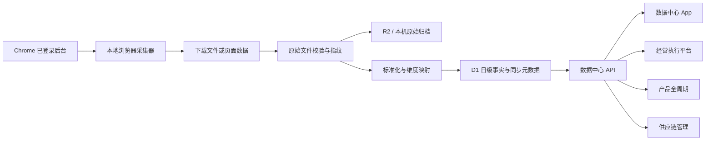

# 数据中心 App 设计

## 目标

在现有经营执行平台中增加第三个独立业务 App“数据中心”，与“供应链管理”和“产品全周期”同级。数据中心统一负责外部经营数据的接入、清洗、口径、质量、查询与跨 App 服务，其他业务 App 不再各自连接快麦、巨量引擎、抖音、快手、天猫等后台。

一期先把已经反复使用的销售与投放数据形成稳定闭环：

1. 从已登录的 Chrome 页面读取或下载数据，不再以快麦开放 API 为主链路。
2. 历史数据一次性回填，之后每日自动同步到截止昨天的数据。
3. 销售报表统一使用订单创建时间，时区为 `Asia/Shanghai`。
4. “其它”保留在原始数据中供审计，但默认排除在日常经营、渠道和运营分析之外。
5. D1 只保存可查询的标准维度、日级事实和同步元数据；原始明细文件进入 R2 或本机归档，避免 D1 因原始明细快速触顶。
6. 产品全周期、经营首页、供应链等消费者只读取数据中心的稳定接口，不感知浏览器采集细节。

## 已确认的安全与业务边界

1. 数据源设置只保存平台、店铺/账户名称、后台网址、统计口径、同步计划和状态，不保存账号密码、短信验证码、二维码、Cookie、Token 或浏览器会话。
2. 登录状态继续由 Chrome、浏览器密码管理器或 macOS 钥匙串负责。登录失效时，数据中心显示“需要人工登录”，由使用者完成扫码、短信或验证码后再恢复同步。
3. 本地采集器只能读取被明确登记的数据源页面，不扫描无关标签页、账号或浏览器历史。
4. 优先使用平台自带导出文件；没有稳定导出时再读取页面表格或页面请求返回。所有来源都要保存采集方式和页面版本，便于平台改版后定位问题。
5. 一期不在云端托管常驻浏览器。定时采集运行在指定的公司 Mac/办公电脑上，要求设备在计划时间开机并保留对应 Chrome 登录状态。
6. 原平台仍是订单、投放和账户配置的事实源；数据中心负责形成可审计的数据副本和跨系统统一口径，不在原平台代替下单、调价、投放或退款操作。

## 方案选择

### 采用：独立数据中心 App + 本地浏览器采集器 + 云端数据服务

数据中心页面继续嵌入当前 React 应用，复用钉钉登录、组织权限、产品档案和现有设计系统。外部页面采集由独立的本地采集器完成，标准数据写入 Cloudflare D1，原始文件写入 R2；其他 App 只访问数据中心 API。

该方案把“采集不稳定”和“业务查询稳定”分开：即使某个平台登录过期或页面改版，既有数据和其他数据源仍可查询；修复采集器时也不需要修改产品、供应链或经营页面。

### 不采用：每个业务 App 自己抓页面

会重复建设登录检测、字段映射、口径和错误处理，同一指标可能在不同 App 得出不同结果。

### 不采用：把账号密码存进 D1，由云端浏览器长期登录

这会扩大凭证泄漏面，并且二维码、短信、滑块和设备风控仍需要人工处理。当前规模下不值得引入这一安全和运维复杂度。

### 暂不采用：把全部订单与投放原始明细直接写入 D1

原始明细增长快、字段变化频繁，也不是多数页面的查询粒度。D1 适合结构化维度和日级事实；原始文件使用 R2 或本机归档更节省容量，也更便于重算。

## 信息架构

主侧边栏顺序为“公司经营 → 数据中心 → 供应链管理 → 产品全周期 → 平台”。数据中心使用与截图中供应链 App 相同的分组、选中态和一级页面结构。

1. **数据总览**：老板视角的销售、毛利、退款、广告消耗、ROI、趋势、目标差距、异常和数据新鲜度。
2. **数据分析**：运营视角按时间、平台、店铺、账户、产品、SKU、计划和素材下钻，对比环比、同比、贡献和效率。
3. **数据接入**：登记平台、店铺/账户、后台地址、采集方式、同步计划和本地执行器；显示登录、采集和最近成功状态。
4. **指标中心**：定义指标编码、中文名称、公式、时间口径、粒度、适用范围、负责人和版本，避免各 App 自行解释 GMV、净销售额、退款、毛利与 ROI。
5. **数据质量**：查看缺日期、重复、字段漂移、店铺未映射、产品未映射、异常波动和跨来源对账差异。
6. **同步记录**：查看每次历史回填、每日增量、重试、成功行数、错误行数、原始文件和错误原因。
7. **数据服务**：查看哪些 App 正在使用哪些数据集和指标、最近读取时间、接口版本、数据新鲜度承诺和影响范围。
8. **设置**：维护全局时区、日切时间、原始文件保留期、异常阈值、角色权限和本地执行器登记。

“业务 Apps”中心登记三项独立应用：产品全周期、供应链管理和数据中心。数据中心入口路由为 `data-overview`，App ID 为 `data-center`。

## 页面设计

### 数据总览

默认时间范围为本月 1 日至昨天，并允许切换昨天、近 7 天、近 30 天、上月和自定义日期。顶部固定展示：

- GMV / 销售额
- 净销售额
- 净销量
- 退款金额与退款率
- 毛利与毛利率
- 广告消耗
- 广告成交额与整体 ROI

指标卡必须同时显示数值、对比基准、数据截止时间和口径入口。没有完整来源的指标显示覆盖率，不用零值伪装完整数据。

核心图表按以下顺序组织：

1. 销售与广告消耗趋势。
2. 平台与店铺贡献。
3. 产品增长、下滑和利润贡献。
4. 广告账户、计划和素材效率。
5. 退款、毛利、同步失败和数据缺口异常。

### 数据分析

分析页使用统一筛选栏：时间、平台、店铺、广告账户、产品、SKU、负责人和指标。默认只展示“已映射且非其它”的正常经营数据。

一期提供四个分析主题：

1. **销售分析**：销售额、净销售额、销量、退款、成本、毛利，按日/店铺/产品/SKU 下钻。
2. **产品分析**：新品与成熟品贡献、增长、退款和毛利，关联现有产品 ID 与 69 码。
3. **投放分析**：消耗、成交、ROI、转化率，按平台/账户/计划/素材下钻。
4. **销售投放联动**：销售趋势与投放趋势同屏，识别放量、自然增长、投放低效和承接问题。

### 数据接入

每个数据源卡片展示：平台图标、店铺/账户标签、后台网址、采集方式、时间口径、本地执行器、计划时间、最近成功时间、最近数据日期和当前状态。

状态固定为：

- `healthy`：按计划完成且数据已到昨天。
- `running`：正在下载、读取、转换或上传。
- `stale`：超过计划时间仍未到昨天。
- `login_required`：页面跳转登录、二维码、短信或验证码。
- `schema_changed`：导出列、表格或页面请求结构变化。
- `failed`：网络、下载、解析、映射或写入失败。
- `disabled`：人工暂停。

新增数据源只填写平台、名称、后台地址、采集方式和计划；账号和密码字段不出现在 Web 页面。页面提供“打开后台登录”和“登录后立即重试”，但不自动填写敏感凭证。

### 指标中心

每个指标必须包含：

- `metricCode`
- 名称与业务解释
- 计算公式
- 时间字段与时区
- 聚合方式
- 适用维度
- 是否默认排除“其它”
- 数据负责人
- 生效版本与变更记录

一期固定销售时间口径为订单创建时间，不向用户提供在付款时间与创建时间之间随意切换的入口。需要其他时间口径时必须新增不同指标编码，不能修改同一指标含义。

## 数据流

单次同步流程：

1. 本地执行器读取数据源配置并打开登记页面。
2. 检查是否仍为已登录业务页面；若出现登录或风控页面，写入 `login_required` 后停止该数据源。
3. 优先触发平台导出并等待文件完成；无法导出时读取已确认的页面表格或请求结果。
4. 计算文件/响应指纹，重复采集不重复入库。
5. 保留原始文件，校验必需字段、日期范围、时区和行数。
6. 统一店铺、账户、产品、SKU、平台和指标字段，无法映射的数据进入质量队列。
7. 使用稳定幂等键覆盖对应来源、日期和维度的数据，不做不可逆累加。
8. 记录同步结果、覆盖日期、原始文件位置、字段版本和数据质量结果。
9. 数据服务更新新鲜度，消费者下一次查询即可读取新数据。

## 每日同步与历史回填

### 每日同步

- 默认每天 `07:30` 运行，目标数据截止前一天 `23:59:59`。
- 销售数据每天重拉最近 7 个自然日，用于吸收退款、售后和平台延迟更新；更早日期只有人工重算或月度校准时覆盖。
- 投放数据每天重拉最近 3 个自然日，具体窗口可按平台延迟调整。
- 单个数据源失败不阻塞其他数据源；使用指数退避重试，登录失效不反复重试验证码页面。
- 当天成功的判定不是“任务执行过”，而是所有启用的关键数据源都已覆盖到昨天，或明确标记为部分覆盖。

### 历史回填

- 按月拆分任务，从平台最早可导出的日期开始补齐到昨天。
- 回填支持暂停、继续、失败重试和按月份重跑，不允许一个超长任务失败后全部重来。
- 每月先落原始文件，再转换为日级事实；重跑同月时按来源和日期范围替换，不重复累计。
- 页面显示月份、来源、行数、覆盖率、文件大小和异常数量。
- D1 容量不足时优先保留标准日级事实和最近同步元数据；原始订单明细不写入 D1。

## 统计口径

### 时间

- 销售事实的业务日期来自订单创建时间 `create_time`。
- 统计时区统一为 `Asia/Shanghai`。
- 默认区间结束日为昨天；今天的数据不进入正式日报、月累计和老板驾驶舱。
- 月度数据按创建时间自然月归属，退款和售后修正通过最近日期重拉或月度校准覆盖。

### 平台与“其它”

- 原始平台值完整保留，标准化后映射为抖音、快手、天猫、京东、小红书、拼多多等明确平台。
- 无法识别的平台进入映射待办，不自动猜测。
- “其它”不进入默认渠道占比、运营排名、店铺对比和异常判断；只有数据质量和审计页面可以查看其数量与来源。

### 产品

- 优先以 69 码/SKU 关联现有产品档案，再使用人工确认的稳定映射。
- 未映射产品不丢弃，进入数据质量队列；在映射前不计入单产品排名，但计入整体覆盖率提示。
- 映射变更保留生效时间和操作人，历史重算必须记录指标与映射版本。

### 指标

一期沿用现有销售事实字段：销量、销售额、净销售额、退款、成本、毛利、发货前退款和发货后退款。每个来源只映射平台真实可获得的字段，缺少字段显示“无数据”，不推测为零。

投放一期至少包含：消耗、展示、点击、成交订单、成交金额、ROI 和转化率。平台口径不同的同名指标必须分别保留来源指标，再由指标中心定义可比较的标准指标。

## 数据模型与存储

### 继续复用的事实表

一期继续使用现有 D1 `product_sales_daily` 作为销售日级事实，避免产品全周期的 `/api/sales` 断裂或维护两份销售聚合。数据中心在其上提供统一查询、口径和新鲜度服务；后续如需更细粒度，再通过版本化迁移扩展，不直接替换现有消费者。

### 新增核心表

#### `data_sources`

- `id`
- `platform`
- `source_type`: `erp_sales | ad_account | shop_sales | review | other`
- `name`
- `account_label`
- `page_url`
- `capture_method`: `export | table | page_request`
- `time_basis`
- `timezone`
- `runner_id`
- `schedule`
- `status`
- `last_success_at`
- `last_data_date`
- `enabled`
- `created_at`
- `updated_at`

不包含账号、密码、Cookie、Token、验证码和浏览器会话。

#### `data_runners`

- `id`
- `name`
- `device_label`
- `version`
- `last_seen_at`
- `status`

只用于识别公司设备上的采集器，不保存设备登录凭证。

#### `data_sync_runs`

- `id`
- `source_id`
- `mode`: `daily | backfill | retry | manual`
- `range_from`
- `range_to`
- `status`
- `started_at`
- `finished_at`
- `rows_read`
- `rows_written`
- `rows_rejected`
- `raw_object_key`
- `schema_version`
- `error_code`
- `error_message`
- `triggered_by`

#### `data_source_files`

- `id`
- `source_id`
- `sync_run_id`
- `file_name`
- `content_hash`
- `object_key`
- `size_bytes`
- `row_count`
- `captured_at`
- `retention_until`

表中只保存文件元数据，文件正文进入 R2；未配置 R2 时保存本地归档路径并在页面明确标记“仅本机可追溯”。

#### `data_dimension_mappings`

- `id`
- `source_id`
- `dimension_type`: `shop | ad_account | product | sku | platform`
- `source_value`
- `target_id`
- `effective_from`
- `effective_to`
- `status`
- `confirmed_by`
- `confirmed_at`

#### 投放事实表

- `data_ad_accounts`
- `data_campaign_daily`
- `data_creative_daily`

事实表使用来源 ID、业务日期、账户/计划/素材稳定 ID 组成唯一键，保存来源原值、标准指标、同步批次和更新时间。

#### 指标、质量与消费关系

- `data_metric_definitions`
- `data_quality_issues`
- `data_app_subscriptions`

`data_app_subscriptions` 记录消费者 App、数据集、指标编码、接口版本、所需新鲜度和启用状态，便于修改口径或停用来源前评估影响。

### D1 容量策略

1. D1 不保存全量原始订单行、页面 HTML、截图或导出文件正文。
2. 默认保存日级事实；只有确实需要投放下钻的计划和素材保留日级明细。
3. 同步日志的详细错误和原始响应进入 R2，D1 只保留摘要和最近状态。
4. 每周统计各表行数与估算容量，达到预警线时先处理日志和冗余索引，不删除业务事实。
5. 数据中心设置页展示 D1、R2 和本地归档的容量、增长速度与预计可用时间。

## API 与跨 App 契约

数据中心接口按查询、管理和采集写入分开：

### 查询接口

- `GET /api/data-center/overview`
- `GET /api/data-center/sales`
- `GET /api/data-center/ad-performance`
- `GET /api/data-center/metrics`
- `GET /api/data-center/quality`
- `GET /api/data-center/health`

所有查询响应包含：

- `data`
- `range`
- `timeBasis`
- `timezone`
- `lastSuccessfulSyncAt`
- `lastDataDate`
- `coverage`
- `metricVersion`
- `warnings[]`

消费者不直接查询 D1 表，也不自行排除“其它”或重算指标。

### 管理接口

- `/api/data-center/sources`
- `/api/data-center/runners`
- `/api/data-center/sync-runs`
- `/api/data-center/mappings`
- `/api/data-center/metric-definitions`
- `/api/data-center/subscriptions`
- `/api/data-center/settings`

### 采集写入接口

- `POST /api/data-center/ingest/start`
- `POST /api/data-center/ingest/batch`
- `POST /api/data-center/ingest/complete`
- `POST /api/data-center/ingest/fail`

本地执行器使用可撤销、最小权限的设备令牌，只能向被分配的数据源和日期范围写入；设备令牌以哈希形式保存，原值只在登记时显示一次。批次写入必须幂等并校验来源、范围、字段版本和内容指纹。

现有 `/api/sales` 在一期保持兼容。数据中心完成销售接口后，产品全周期逐步切换到 `/api/data-center/sales`，切换期间对同一日期范围做一致性校验。

## 权限

- **总经办**：查看全部经营、销售、投放、质量和同步数据；查看数据服务影响范围。
- **数据管理员**：管理数据源、执行器、字段映射、历史回填、指标定义和质量问题，不自动获得平台账号密码。
- **运营负责人/运营**：查看授权店铺、账户、产品与素材分析；不能修改全局指标口径。
- **财务**：查看销售、退款、成本、毛利及对账结果；默认不维护投放采集配置。
- **产品与供应链**：通过产品范围查看销售、退款、质量和库存所需数据，不查看无关账户敏感明细。
- **其他业务 App**：只能通过服务端订阅契约读取获批数据集，不能使用本地执行器写入接口。

后端执行同样的权限与范围校验，不能只通过前端隐藏页面。数据源页面 URL、设备状态和详细错误只对数据管理员与总经办可见。

## 错误、质量与审计

- 登录失效、字段变化、下载超时、文件为空、日期不完整、重复文件、写入失败使用不同错误码。
- 同步失败保留上次成功数据和新鲜度时间，不清空消费者页面。
- 字段变化时保留原始文件并停止覆盖对应事实，避免错误列被当成正确数据。
- 每次重跑按来源和日期范围替换，通过事务或等价的分批提交保证不会留下半批结果。
- 数据源、映射、指标、回填、手动重试和执行器令牌操作全部记录操作人、时间、原因和前后值。
- 数据质量异常可以被指派、备注、解决和重新验证，关闭异常不修改原始数据。
- 任何老板或运营指标都可以追溯到来源、业务日期、同步批次、指标版本和原始文件。

## 一期交付顺序

### 阶段 1：App 壳与数据服务基础

- 把供应链实现分支整合进当前主开发线，确保三 App 共用同一导航基础。
- 增加数据中心导航、业务 Apps 注册、权限项和八个一级页面骨架。
- 新增数据中心 D1 表、API、Provider、空状态和数据新鲜度组件。
- 复用 `product_sales_daily`，先让数据总览和销售分析读取已有销售数据。

### 阶段 2：快麦网页采集与历史回填

- 建立本地执行器、数据源登记、登录状态检测、导出下载、原始归档和批次上传。
- 使用订单创建时间完成历史回填，默认排除“其它”。
- 增加每日任务、最近 7 日回拉、月份重跑和同步记录。
- 废弃数据中心日常链路中的快麦开放 API；旧接口保留到新链路连续稳定后再移除。

### 阶段 3：巨量千川 / 巨量引擎

- 接入账户、计划和素材日级数据。
- 建立广告账户与产品映射，完成投放分析和销售投放联动。
- 加入账户覆盖率、素材字段漂移和跨页面对账。

### 阶段 4：其他店铺与消费者迁移

- 按优先级接入抖音店铺、快手、天猫等后台。
- 产品全周期、经营首页和供应链逐步改为读取数据中心接口。
- 在数据服务页展示订阅关系、版本和新鲜度承诺。

## 测试与验收

### 领域测试

- 创建时间、时区、昨天截止、自然月归属和最近日期重拉。
- “其它”在原始审计中保留，在默认经营分析中排除。
- 店铺、账户、产品、SKU 映射的有效期和历史重算。
- 销售、退款、毛利、投放和 ROI 指标版本。
- 同一文件、同一日期范围和同一批次的幂等覆盖。

### API 与存储测试

- D1 建表、分页、批次写入、范围替换、权限和设备令牌哈希。
- `product_sales_daily` 兼容性和新旧销售接口一致性。
- 原始文件元数据、R2 对象引用、容量统计和保留期。
- 登录失效、字段漂移、空文件、重复内容、半批失败和恢复。

### 采集器测试

- 使用固定 HTML、表格响应和导出文件测试，不在自动测试中操作真实店铺。
- Chrome 已登录、跳转登录、二维码、短信验证、下载超时和页面改版状态识别。
- 设备离线后恢复、任务暂停继续、按月回填和单来源失败隔离。

### UI 验收

- 数据中心作为独立分组出现在供应链管理之前，选中态和截图中的现有导航一致。
- 从业务 Apps 打开数据中心，并能在三个业务 App 之间正常切换。
- 总览、分析、接入、指标、质量、记录、服务和设置都有加载、空、错误、过期和无权限状态。
- 指标数值同时展示口径、截止时间、覆盖率和来源追溯。
- 桌面端、窄屏和钉钉内嵌 WebView 完成层级、间距、对齐、滚动、焦点和控件行为检查。

## 一期不包含

- 在数据中心保存或自动填写平台账号密码、验证码、Cookie 和浏览器 Token。
- 在无人维护的云端浏览器长期绕过平台登录和风控。
- 替代快麦、巨量引擎、抖音、快手或天猫的业务操作后台。
- 把所有历史原始订单和页面内容写入 D1。
- 同时接完所有平台；一期先完成快麦销售，再完成巨量千川/巨量引擎。
- 未经确认的生产部署、真实凭证写入或全量历史数据回填。
